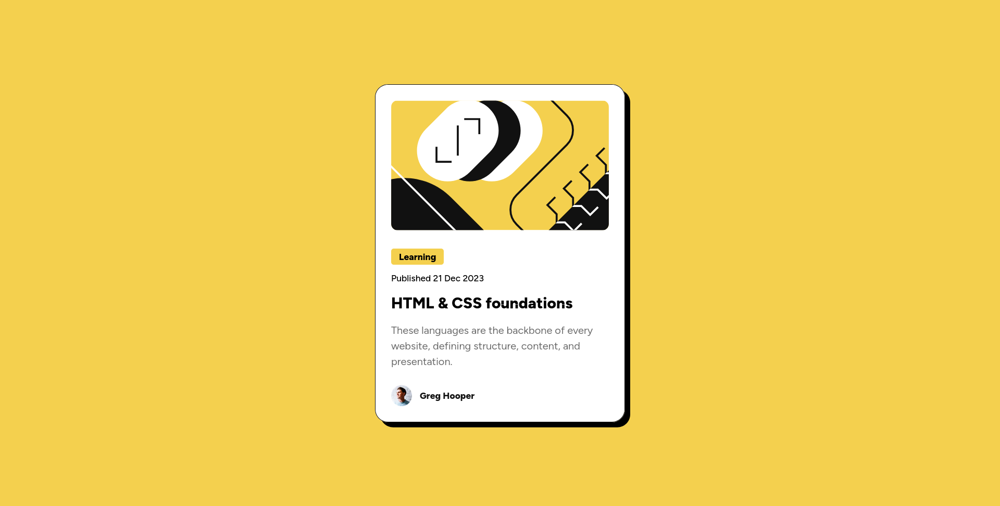

# Frontend Mentor - Blog preview card solution

This is a solution to the [Blog preview card challenge on Frontend Mentor](https://www.frontendmentor.io/challenges/blog-preview-card-ckPaj01IcS). Frontend Mentor challenges help you improve your coding skills by building realistic projects.

## Table of contents

- [Overview](#overview)
  - [The challenge](#the-challenge)
  - [Screenshot](#screenshot)
  - [Links](#links)
- [My process](#my-process)
  - [Built with](#built-with)
  - [What I learned](#what-i-learned)

## Overview

### The challenge

Users should be able to:

- See hover and focus states for all interactive elements on the page

### Screenshot

Here is what I built.

### Links

- Solution URL: [My solution page](https://www.frontendmentor.io/solutions/blog-preview-card-eKjIJhou1g)
- Live Site URL: [check live page](https://iamnotn3rd.github.io/blog-preview-card/)

## My process

- I tried to do that challenge without looking Figma design file.
- Later I found Frontend Mentor also provided with design file.
- So I give a try and it's awesome to do the full design with Figma.

### Built with

- Semantic HTML5 markup
- CSS custom properties
- Flexbox

### What I learned

How to use Figma file (in basic level)
